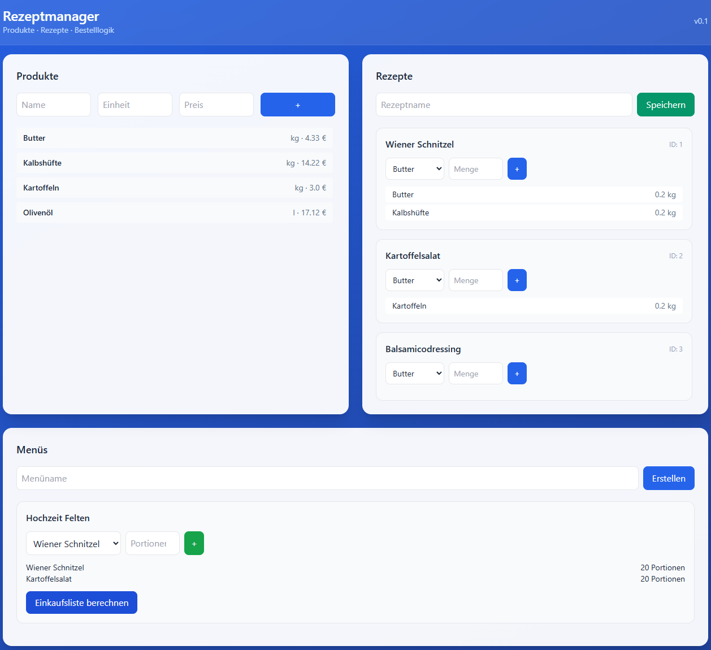
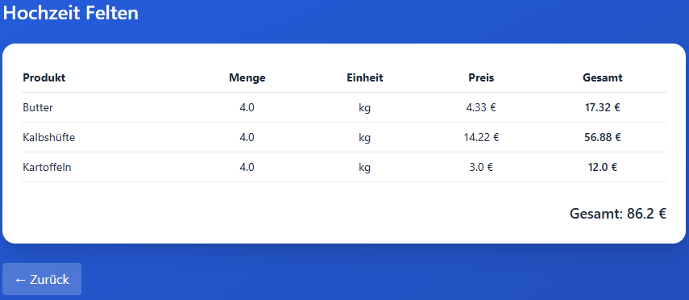

# Rezeptmanager & KI-Bestellsystem

Ein webbasiertes System zur Verwaltung von Rezepten und automatischen Berechnung von Bestellmengen basierend auf Menüs und Personenanzahl.

## Features

* Produkte verwalten (Preis, Einheit)
* Rezepte mit Zutaten erstellen
* Menüs zusammenstellen
* Automatische Einkaufsliste berechnen
* Kostenberechnung pro Menü

## Tech Stack

* Python (Flask)
* SQLite
* HTML + TailwindCSS

## Installation

```bash
git clone https://github.com/DEIN_USERNAME/rezeptmanager.git
cd rezeptmanager
python -m venv venv
venv\Scripts\activate
pip install -r requirements.txt
python run.py
```

## Nutzung

1. Produkte anlegen
2. Rezepte erstellen + Zutaten hinzufügen
3. Menü erstellen
4. Einkaufsliste berechnen

## Ziel

Grundlage für ein KI-basiertes System zur automatischen Bestelloptimierung in der Gastronomie.

## Screenshots



